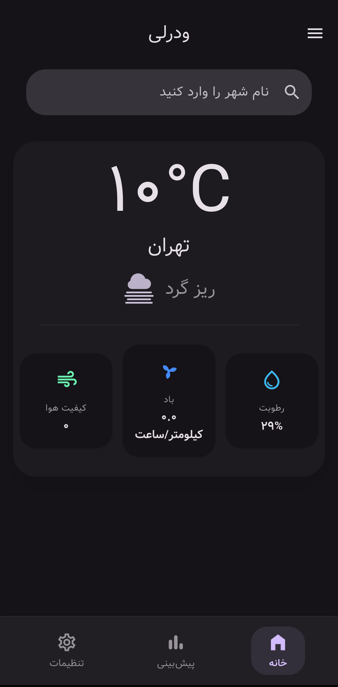
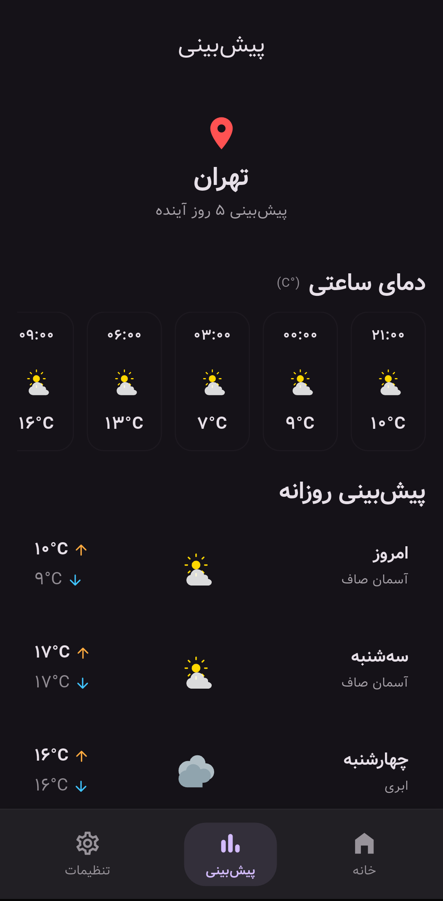

# Weatherly ☀️

<div align="center">


**A modern, multilingual weather app with beautiful UI**

Fast performance, minimal design, professional user experience

[](https://github.com/MRAmin0/Weatherly/releases)
[](https://flutter.dev)
[](https://dart.dev)
[](LICENSE)

**[🌐 Web Version](https://weatherly-zeta.vercel.app/)** • **[📥 Download APK](https://github.com/MRAmin0/Weatherly/releases/download/v2.0.0/weatherly-v2.0.0.apk)** • **[🛍 Myket](https://myket.ir/app/com.weatherly.app)**

**🇮🇷 [نسخه فارسی](README_FA.md)**

</div>

---

## 📸 Screenshots

<div align="center">

|         Home          |         Forecast         |            Settings             |
| :------------------------: | :----------------------------: | :----------------------------: |
|  |  |  |

</div>

---

## ✨ Key Features

### 🌤 Weather Info
- 🔍 **Smart city search** with live suggestions
- 🌡 **Current weather** with full details (temp, humidity, wind, pressure)
- 📅 **5-day forecast** with high accuracy
- ⏰ **Hourly forecast** for precise planning
- 💨 **Air Quality Index (AQI)** with color coding

### 🔔 Smart Notifications (NEW in v2.0.0)
- ☔ Weather-based tips ("Take an umbrella!", "Wear sunglasses!")
- ⏰ Daily morning alerts with customizable time
- 🧪 Test notification button for preview

### 🎨 User Interface
- 🌈 **Material Design 3** with Dynamic Color
- 🎭 **Material You** support (Dynamic colors)
- 🌓 **Light/Dark theme** with smooth transition
- ✨ **Smooth animations** (rotate, pulse, slide)
- 📱 **Responsive design** for mobile and web

### 🌍 Multilingual
- 🇮🇷 **Persian (RTL)** — Full right-to-left support
- 🇬🇧 **English (LTR)** — Standard international interface
- 🔄 **Easy language switch** from settings

### ⚙️ Advanced Features
- 💾 **Auto-save** user preferences
- 🌡 **Temperature unit** selection (Celsius/Fahrenheit)
- 📍 **Save favorite cities**
- 🎯 **Default city** configurable
- 📶 **Offline mode** with smart caching

---

## 📦 Download

### From Myket

<div align="center">

[](https://myket.ir/app/com.weatherly.app)

**Easy install with automatic updates**

</div>

### Direct APK Download

<div align="center">

[](https://github.com/MRAmin0/Weatherly/releases/download/v2.0.0/weatherly-v2.0.0.apk)

**File size:** ~57 MB | **Android:** 5.0+ (API 21)

</div>

### Web Version

Use [Weatherly Web](https://weatherly-zeta.vercel.app/) without installation.

---

## 🚀 Development Setup

### Prerequisites

```bash
Flutter SDK: 3.35.7+
Dart SDK: 3.9.2+
Android Studio / VS Code (optional)
```

Check Flutter version:

```bash
flutter --version
```

### Installation Steps

#### 1️⃣ Clone Repository

```bash
git clone https://github.com/MRAmin0/Weatherly.git
cd Weatherly
```

#### 2️⃣ Install Dependencies

```bash
flutter pub get
```

#### 3️⃣ Generate Localization Files (Required ⚠️)

```bash
flutter gen-l10n
```

> **Note:** Run this command after every change to ARB files in `l10n/` folder.

#### 4️⃣ Run App

For device/emulator:

```bash
flutter run
```

For browser:

```bash
flutter run -d chrome
```

For release APK:

```bash
flutter build apk --release
```

---

## 📝 Changelog

### 🔔 Version 2.0.0 (Latest)
- ✨ Smart weather notifications
- ⏰ Daily morning alerts with custom time
- 🧪 Test notification button
- 🐛 Fixed connection error on startup

### 💎 Version 1.9.0
- 🎨 Complete UI redesign
- 🌈 Dynamic backgrounds
- ✨ New animations

### 🌈 Version 1.8.0
- ✨ Full ColorScheme integration
- 🎨 Updated backgrounds, search bar, AQI card
- 🌈 Dynamic color support (Material You)
- � Full Material Design 3 support

### ⭐ Version 1.7.0
- � Bug fixes and stability improvements
- 📡 Proper message when offline

---

## 🧪 Testing & Development

### Useful Commands

```bash
# Analyze code
flutter analyze

# Run tests
flutter test

# Run web version
flutter run -d chrome

# Check outdated dependencies
flutter pub outdated

# Format code
dart format .
```

---

## 🤝 Contributing

We welcome contributions!

### How to Contribute:

1. **Fork** the repository
2. Create a **branch** (`git checkout -b feature/amazing-feature`)
3. **Commit** changes (`git commit -m 'Add amazing feature'`)
4. **Push** to branch (`git push origin feature/amazing-feature`)
5. Create a **Pull Request**

### Report Issues

Found a bug? Please create an [Issue](https://github.com/MRAmin0/Weatherly/issues) with:
- Detailed description
- Steps to reproduce
- Screenshots (if possible)
- Device info and app version

---

## 🙏 Acknowledgments

This project uses:

- 🌦 **Weather data:** [Open-Meteo API](https://open-meteo.com/)
- 📦 **State management:** [Provider](https://pub.dev/packages/provider)
- 🎨 **Design system:** [Material Design 3](https://m3.material.io/)
- 🚀 **Framework:** [Flutter](https://flutter.dev/)

---

## 📄 License

This project is licensed under the MIT License. See [LICENSE](LICENSE) for details.

---

## 👨‍💻 Author

**Developer:** Amin Monajati

- 📧 Email: aminmonajati9@gmail.com
- 🐙 GitHub: [@MRAmin0](https://github.com/MRAmin0)
- 🌐 Website: [mramin0.github.io](https://mramin0.github.io)

---

<div align="center">

**Made with ❤️ and ☕**

If you found this project useful, please give it a ⭐️!

[](https://github.com/MRAmin0/Weatherly/stargazers)
[](https://github.com/MRAmin0/Weatherly/network/members)

</div>
